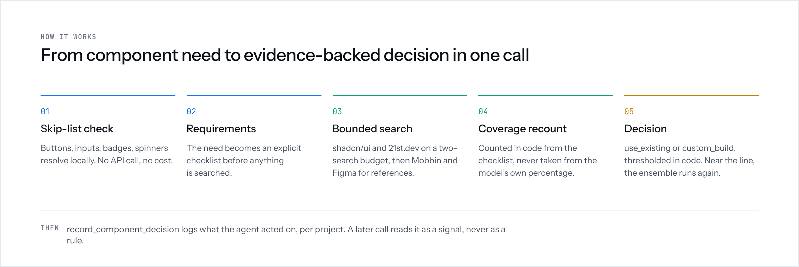

# Pattern

[](https://github.com/donaldrichard19-LVD/pattern-mcp/actions/workflows/publish.yml)
[](https://www.npmjs.com/package/pattern-mcp)
[](https://www.npmjs.com/package/pattern-mcp)
[](./LICENSE)

Pattern is an MCP server that checks a UI component need against real,
current evidence before your agent commits to it, so a wrong decision
gets caught before it's built, not after.

[Website](https://usepattern.sh) · [npm](https://www.npmjs.com/package/pattern-mcp) · [Report an issue](https://github.com/donaldrichard19-LVD/pattern-mcp/issues/new/choose)

## Install

```bash
npm install pattern-mcp
```

See [Quick Start](#quick-start) below to add your Anthropic API key and connect
Pattern to your MCP client.

## What Pattern Does

Instead of returning a list of search results, Pattern looks at what you
need, checks real components against that need, and tells the agent
whether to:

- **Use an existing component** from shadcn/ui, 21st.dev, or ReUI
- **Build a custom component**, using a real product reference from
  Mobbin and/or Figma Community

Pattern is designed for agents to use **while they are building**.

It exposes three tools:

- `recommend_component` — evaluates a UI component need and returns a
  structured recommendation.
- `extract_requirements` — runs just the requirement-extraction step on
  its own, so you can inspect or hand-edit the checklist before
  `recommend_component` spends its search+score budget on it.
- `record_component_decision` — records what the agent actually did so
  future recommendations in the same project can take that decision into
  account.

## How it works



For each `recommend_component` call, Pattern:

1. Checks whether the need is a simple primitive that doesn't require a
   search.
2. Turns the request into a set of specific requirements, unless a
   checklist was already supplied (see [`checklist`](#checklist)).
3. Searches for matching shadcn/ui, 21st.dev, and ReUI components.
4. Checks each candidate against the requirements using evidence from the
   actual component.
5. Calculates how much of the requirement is covered.
6. Decides whether to use an existing component or build a custom one.
7. If a custom build is needed, searches Mobbin and Figma Community for
   real product examples.
8. Returns the result as structured JSON the calling agent can act on.

Coverage is calculated by the server from the individual requirements it
checked. It does not simply trust the percentage returned by the model.

A result can also be:

- `use_existing`
- `custom_build`
- `no_candidates_found`
- `skip_list`

`no_candidates_found` is kept separate from a low-coverage result. Not
finding a candidate is different from finding candidates that don't cover
the requirements.

If `project_id` is supplied, Pattern also checks for past confirmed
decisions on that project and factors them in as a consistency signal —
never a rule that overrides a genuinely better match found in the current
search.

Every result includes `computed_at`, because coverage is a snapshot of the
search at that point in time, not a permanent fact. Every result also
includes `_meta` — the timing and token cost of that specific call (see
[Cost](#cost)).

### Boundary-risk checks

The same evidence can sometimes be judged slightly differently between
model runs. When a result is close enough to a decision threshold that it
could change the verdict, Pattern automatically runs the judgment two more
times and uses the majority result.

If the three runs disagree, Pattern returns:

```json
{
  "confidence": "low",
  "ensemble": {
    "triggered": true,
    "runs": ["use_existing", "custom_build", "use_existing"],
    "agreement": "2/3"
  }
}
```

Results that are clearly inside a threshold don't trigger extra runs — see
[Cost](#cost) below for the measured impact.

### Simple primitives

These are handled locally without an API call:

| Primitive | Use it for |
| --- | --- |
| `button` | A clickable action trigger |
| `input` | A single-line text entry field |
| `checkbox` | A binary on/off toggle |
| `label` | A caption for a field or control |
| `badge` | A small status or count indicator |
| `spinner` | An indeterminate loading indicator |
| `tooltip` | A contextual hover/focus hint |
| `avatar` | A user or entity image, or initials |
| `icon` | A single glyph or symbol |

This keeps trivial requests fast and avoids unnecessary API usage.

### What powers the search

Pattern does not scrape shadcn/ui, 21st.dev, ReUI, Mobbin, or Figma Community
itself.

Each tool call makes one or more requests to the Anthropic Messages API,
using `claude-sonnet-5` by default. The server enables Anthropic's
`web_search` tool and provides a system prompt that defines the full
decision process.

That process includes:

- Skip-list checks
- Requirement extraction
- Component search
- Evidence-based coverage scoring
- Decision thresholds
- Mobbin and Figma Community reference searches when a custom build is
  needed

Figma Community does not require a Figma API key. Pattern uses the same
web search mechanism for Figma Community as it does for the other sources.

The model returns structured JSON. Pattern then applies important checks
itself, including recalculating coverage and applying the decision
threshold.

## Quick Start

### 1. Install

```bash
npm install pattern-mcp
```

This installs the `pattern-mcp` command via `npx` (or your project's
local `node_modules/.bin`), used in the client configs below.

<details>
<summary>Build from source instead</summary>

```bash
git clone <this repo>
cd pattern-mcp
npm install
npm run build
```

Use `node /absolute/path/to/pattern-mcp/dist/index.js` as the server
command in place of `npx pattern-mcp` in the examples below.

</details>

### 2. Add your Anthropic API key

Pattern requires:

```
ANTHROPIC_API_KEY
```

The API account associated with this key pays for the requests Pattern
makes (see [Cost](#cost) below).

You get the key from the Anthropic Console under Settings → API Keys.
API billing is separate from Claude.ai or Claude Code subscriptions. A
Claude Pro or Max subscription does not include API usage.

### Connect Pattern to your MCP client

Pattern is a standard MCP server, so it works with MCP-compatible
clients.

The server command is:

```
npx pattern-mcp
```

#### Claude Code

You can add Pattern to your project's `.mcp.json` or register it with the
CLI.

For the current project:

```bash
claude mcp add pattern \
  -e ANTHROPIC_API_KEY=sk-ant-... \
  -- npx pattern-mcp
```

This uses the default local scope, so the server is available to the
current project.

To make Pattern available across your projects:

```bash
claude mcp add pattern \
  -e ANTHROPIC_API_KEY=sk-ant-... \
  --scope user \
  -- npx pattern-mcp
```

**Important:** put `-e`/`--env` and `--scope` before the `--`. Everything
after `--` is treated as the command and its arguments.

Check the connection with:

```bash
claude mcp list
```

You should see Pattern with a `✔ Connected` status.

`claude mcp add` stores the configuration in `~/.claude.json`. Avoid
`claude mcp get pattern` when possible because it can print your API key
in plaintext.

#### Cursor

Add Pattern to:

```
.cursor/mcp.json
```

#### Codex CLI

Pattern can be configured globally in:

```
~/.codex/config.toml
```

or at the project level in:

```
.codex/config.json
```

Use the MCP configuration format supported by your Codex CLI version.

#### Claude Desktop

Add Pattern through Claude Desktop's MCP settings.

The configuration looks like:

```json
{
  "mcpServers": {
    "pattern": {
      "command": "npx",
      "args": ["pattern-mcp"],
      "env": {
        "ANTHROPIC_API_KEY": "sk-ant-..."
      }
    }
  }
}
```

Restart your MCP client after adding Pattern.

Then ask your agent to list its available MCP tools and look for:

```
recommend_component
```

## Try it

Give your agent a specific UI need, for example:

> Use recommend_component to find me a UI component for a price breakdown
> showing nightly rate, cleaning fee, service fee, and taxes. I'm building
> an Airbnb-style booking checkout in React with Tailwind.

The agent should use the result to make the next decision:

- Install or use the recommended component, or
- Start a custom build using the returned requirements and product
  references.

Pattern returns useful descriptions for both paths.

- For an existing component, `component_description` explains what the
  component does and looks like before the agent installs it.
- For a custom build, `reference_description` explains what each Mobbin
  or Figma Community reference actually shows.

These descriptions are grounded in what Pattern found during the search
rather than generic descriptions.

## Validation examples

Pattern's validation suite uses five UI needs from an Airbnb-style rental
marketplace:

- Price breakdown with fees and taxes
- Cancellation policy display
- Host earnings dashboard
- Property image gallery
- Host-guest messaging inbox

Together, these cover different outcomes, including clear matches,
false-positive-prone searches, no candidates, and decisions close to the
threshold.

## Tool: `recommend_component`

### Input

```json
{
  "component_need": "price breakdown with fees and taxes",
  "domain": "Airbnb-style rental marketplace",
  "framework": "React + Tailwind",
  "existing_stack": "already using shadcn/ui",
  "project_id": "my-booking-app"
}
```

`component_need` should describe the actual UI you need, not just a
category.

Good: `price breakdown with fees and taxes`
Too vague: `pricing`

Vague requests can produce misleading matches. For example, a generic
SaaS pricing table may look like a match for "pricing" even though it
doesn't work for a booking checkout.

#### `project_id`

`project_id` is optional.

When provided, Pattern can use decisions previously recorded for the
same project (see [Per-project decision memory](#per-project-decision-memory))
as a consistency signal.

A previous decision can help the model stay consistent with similar UI
decisions, but it cannot override a better match found in the current
search.

Pattern still searches and scores every request from scratch. Past
decisions never cause a search to be skipped.

If you leave out `project_id`, Pattern does not use project memory.

#### `checklist`

`checklist` is optional -- an array of requirement strings.

When provided, `recommend_component` skips its own internal requirement
extraction entirely and scores coverage against exactly the items you
passed, instead of extracting its own checklist. Search and scoring still
run fresh every call; only the extraction step is skipped.

This is meant to be used together with [`extract_requirements`](#tool-extract_requirements):
call `extract_requirements` first, inspect (or hand-edit) the checklist it
returns, then pass that checklist here. That gives you a chance to catch a
misread requirement before Pattern spends its search+score budget.

Leave `checklist` out to keep today's default behavior: `recommend_component`
extracts its own checklist internally, exactly as before this option
existed.

**Is the checklist actually skipped, not just re-derived?** Checked, not
assumed. `breakdown_ms.extract` for a `checklist`-provided call is smaller
than the default path's, but not near-zero -- which raised the question of
whether the model is still doing some of the extraction work in that
window rather than treating the checklist as fixed input. Reading the
model's actual reasoning (via `thinking` with `display: "summarized"`,
5 runs: 3 with `checklist` provided, 2 default) answered it: the
`checklist`-provided runs' pre-search reasoning was a short, generic
"search shadcn/ui and 21st.dev" thought with no mention of the checklist's
content, e.g. *"I should look for existing image gallery component options
on shadcn/ui and 21st.dev"* -- consistently ~3-4 seconds. The default
runs' reasoning, by contrast, explicitly enumerated and derived the
checklist items (*"...mapping out the checklist: a photo grid with hero
and thumbnails... a full-screen lightbox with next/prev navigation,
keyboard support..."*) and took roughly 2x longer (~7-8 seconds). The
remaining time in the `checklist`-provided path is baseline model latency
before it decides to search, not re-extraction -- it doesn't scale with or
reference the checklist's content.

### Output

```json
{
  "verdict": "use_existing | custom_build",
  "confidence": "high | medium | low",
  "reason": "scored | no_candidates_found | skip_list",
  "computed_at": "2026-08-23",
  "requirements_checked": [
    {
      "requirement": "...",
      "met": true,
      "evidence": "..."
    }
  ],
  "coverage": "5/7 (71%)",
  "recommendation": {
    "source": "21st.dev | shadcn | reui | null",
    "install_command": "string | null",
    "component_description": "string | null",
    "reference": {
      "source": "Mobbin | Figma Community",
      "url": "...",
      "flow_name": "...",
      "file_name": "...",
      "reference_description": "...",
      "url_type": "deep_link | entry_point"
    }
  },
  "ensemble": {
    "triggered": false
  },
  "checklist_source": "extracted | provided",
  "_meta": {
    "total_ms": 41516,
    "breakdown_ms": { "extract": 5006, "search": 3114, "score": 33396 },
    "tokens_used": { "input": 8400, "output": 620 },
    "estimated_cost_usd": 0.14
  }
}
```

The `past_decision_signal` field is included only when there is a
relevant previous decision for the supplied `project_id`.

`checklist_source` is always present: `"extracted"` when Pattern derived
the checklist itself (the default, unchanged behavior), `"provided"` when
you passed one in via `checklist`.

`_meta` is always present. See [Cost](#cost) for what each field means,
how `breakdown_ms` is measured, and what it means when the ensemble
triggers.

### Reference links

When Pattern recommends a custom build, it may return references from
Mobbin, Figma Community, or both.

The `reference` field can be:

- An array when both sources returned useful results.
- A single object when only one source returned a useful result.
- `null` when neither source produced a grounded reference.

#### Deep links vs. entry points

Pattern tells you whether a reference URL points directly to the
identified screen or flow.

`"url_type": "deep_link"` means Pattern verified that the URL points to
the specific reference.

`"url_type": "entry_point"` means the URL is a search or browse page. The
agent may need to find the specific screen or flow from there.

For Mobbin, Pattern fetches the search result page and looks for a more
specific link to the screen or flow it identified.

For Figma Community, URLs containing `/community/file/` are already
specific to a file and are treated as deep links. Other Figma URLs are
checked like Mobbin URLs.

Pattern never invents a URL. If it cannot verify a specific link, it
keeps the real search result URL and clearly identifies it as an entry
point.

### Installation commands are not trusted

The `install_command` comes from search results. It is not verified
against a package registry, and Pattern does not execute it.

The calling agent should:

1. Show the command to the user.
2. Get confirmation.
3. Run it only after confirmation.

See [SECURITY.md](./SECURITY.md) for more details.

## Tool: `extract_requirements`

Runs only the requirement-extraction step `recommend_component` normally
does internally, and returns just the checklist -- no search, no scoring,
no verdict.

This is an opt-in, two-call pattern for agents that support tool search or
code-mode style tool use: call `extract_requirements` first, inspect (or
hand-edit) the checklist it returns, then pass that checklist to
`recommend_component`'s optional `checklist` input to score against it
directly, skipping `recommend_component`'s own internal extraction.

The single-call default -- just calling `recommend_component` with no
`checklist` -- is unchanged and is still the recommended path for most
callers. Reach for `extract_requirements` when you specifically want to
catch a misread requirement before Pattern spends its search+score budget,
not as a routine first step.

### Input

```json
{
  "component_need": "image gallery for a property listing",
  "domain": "Airbnb-style rental marketplace"
}
```

Same fields, same meaning, as `recommend_component`'s `component_need` and
`domain`. There is no `framework` input here -- extraction is grounded in
the domain, not the framework, so `framework` doesn't affect the checklist
in `recommend_component` either.

### Output

```json
{
  "checklist": ["...", "...", "..."],
  "extraction_confidence": "high | medium | low",
  "_meta": {
    "total_ms": 6798,
    "breakdown_ms": { "extract": 6798, "search": 0, "score": 0 },
    "tokens_used": { "input": 275, "output": 302 },
    "estimated_cost_usd": 0.0036
  }
}
```

Typical latency is a few seconds -- one small API call with no tools
declared, versus `recommend_component`'s full search+score pipeline.

**`extraction_confidence` is a placeholder heuristic, not a validated
signal.** It's currently derived from how specific `component_need` is
(word count) -- the same "vague category name" problem the rest of this
README warns about elsewhere. It is not based on any measured correlation
with actual extraction quality. Treat `"low"` as a prompt to reread your
`component_need`, not as a calibrated confidence score. This is flagged
here as a known gap, to revisit once there's real usage data to base a
better signal on.

Trivial primitives (see [Simple primitives](#simple-primitives)) return an
empty `checklist` with `extraction_confidence: "high"` and no API call, the
same local skip-list short-circuit `recommend_component` uses.

## Tool: `record_component_decision`

Use this tool after the agent has actually acted on a component
decision.

For example, call it after:

- Installing an existing component
- Completing a custom build

Do not call it for every recommendation.

The tool only saves the decision. It does not run a judgment or make an
Anthropic API call.

### Input

```json
{
  "project_id": "my-booking-app",
  "component_need": "price breakdown with fees and taxes",
  "domain": "Airbnb-style rental marketplace",
  "action": "custom_built",
  "source": "custom",
  "timestamp": "2026-08-25T14:32:00.000Z",
  "time_saved_minutes": 25
}
```

- `project_id` is required and should be stable. A project directory
  path or project name works well.
- `action` must be `"installed"` or `"custom_built"`.
- `source` can be `"shadcn"`, `"21st.dev"`, `"reui"`, or `"custom"`.
- `timestamp` is optional. If omitted, Pattern uses the current time.
- `time_saved_minutes` is optional -- the calling agent's own estimate,
  in minutes, of how much time this decision saved by having Pattern's
  verdict instead of researching candidates and judging fit from scratch.
  This is entirely self-reported. Pattern has no way to measure a
  counterfactual ("how long would this have taken without Pattern?"), so
  unlike `_meta` (Pattern's own real cost/latency for the call that
  produced the verdict), this number is never computed or verified --
  it's just recorded as-given. Omit it rather than guess a number to fill
  the field.

### Output

```json
{
  "status": "recorded",
  "project_id": "my-booking-app",
  "entry": { "..." }
}
```

## Per-project decision memory

Pattern stores confirmed decisions locally in:

```
~/.pattern/memory.json
```

You can change the location with:

```
PATTERN_MEMORY_PATH
```

The file is organized by project:

```json
{
  "my-booking-app": [
    {
      "component_need": "price breakdown with fees and taxes",
      "domain": "Airbnb-style rental marketplace",
      "action": "custom_built",
      "source": "custom",
      "timestamp": "2026-08-25T14:32:00.000Z",
      "time_saved_minutes": 25
    }
  ]
}
```

`time_saved_minutes` is omitted from an entry entirely when the calling
agent didn't provide one -- it's never backfilled or estimated by Pattern.

Each project keeps its 50 most recent decisions. Older entries are
removed as new ones are added.

Only decisions explicitly recorded through `record_component_decision`
are saved. Pattern does not automatically save recommendations.

If an agent ignores or changes a recommendation, nothing is recorded
unless the agent explicitly calls `record_component_decision` with what
it actually did.

The memory file is local plaintext. Pattern does not send it anywhere.

`component_need` and `domain` are stored in this file, so avoid putting
sensitive information in them. See [SECURITY.md](./SECURITY.md).

A failure to write the decision file is returned as an error from
`record_component_decision`.

**No caching, by design.** Project memory does not cache recommendations.
A previous decision is only additional context for a new judgment. Every
`recommend_component` call performs a fresh search and recalculates
coverage. This means Pattern can use past decisions to improve
consistency without letting stale decisions replace current evidence —
see [Known limitations](#known-limitations) for more.

## Security and privacy

Pattern uses the Anthropic API and web search to make its
recommendations.

Local project memory and the local call log are stored on the machine
running Pattern. They are not sent anywhere by Pattern itself.

Review [SECURITY.md](./SECURITY.md) before putting sensitive information
into fields such as `component_need`, `domain`, or project IDs.

## Cost

Pattern uses the Anthropic API, so `recommend_component` has a cost.

A typical single pass costs about $0.06–$0.10 with Sonnet 5 at current
pricing. Skip-listed primitives cost $0 because they're handled locally
and never reach the API.

### The `_meta` field

Every `recommend_component` and `extract_requirements` response includes
an internal `_meta` block reporting what that call actually spent:

```json
{
  "total_ms": 41516,
  "breakdown_ms": { "extract": 5006, "search": 3114, "score": 33396 },
  "tokens_used": { "input": 8400, "output": 620 },
  "estimated_cost_usd": 0.14,
  "scoring_fetch": { "attempted": true, "succeeded": true, "url": "https://ui.shadcn.com/docs/components/..." }
}
```

- `total_ms` -- wall-clock time for the call.
- `tokens_used` -- total input tokens (fresh + cache write + cache read,
  summed) and output tokens, read directly from the API response's own
  usage data.
- `estimated_cost_usd` -- computed from `tokens_used` at Pattern's
  configured model's current per-token rate (checked against Anthropic's
  pricing, not assumed). This is an estimate: it doesn't account for
  pricing changes Pattern hasn't been updated for, or any account-specific
  discounts.
- `breakdown_ms` -- how `total_ms` splits across `recommend_component`'s
  three internal phases.
- `scoring_fetch` -- whether step 4's single candidate-verification fetch
  (see [Fetch-grounded scoring](#fetch-grounded-scoring-and-reference-verification)
  below) actually happened for this response. `url` is `null` when
  `attempted` is `false` (no real candidate to verify, e.g. `reason:
  "no_candidates_found"` or `"skip_list"`). This is a diagnostic only --
  Pattern never uses it to auto-correct `requirements_checked` after the
  fact, since there's no safe fallback value for an unverified met/not-met
  call the way there is for a reference URL.

**How `breakdown_ms` is measured, and its one real caveat.** The bundled
call runs extraction, search, and scoring inside a single model turn
(search/fetch happen server-side, not as separate requests this code
makes), so there's no natural place for three separate stopwatches.
Pattern gets a real per-phase split by streaming the response and timing
content-block boundaries instead: `extract` ends the moment the first
search call starts, and `search` ends when that first wave of search
calls and results finishes. This was checked against real traces (not
assumed) across both `use_existing` and `custom_build` cases before
shipping, and both boundaries land cleanly and consistently.

The one place this needs a caveat: for a `custom_build` verdict, step 6's
Mobbin/Figma reference search and its deep-link verification fetch happen
*after* the coverage-scoring reasoning that decided `custom_build` in the
first place -- so `breakdown_ms.score`, for those cases, covers coverage
scoring **and** reference-finding **and** the final write-up, not just
"scoring" in the narrow step-4 sense. It's still a real, measured number;
it's just a wider bucket for `custom_build` than for `use_existing`. This
is disclosed here rather than presented as a narrower number than it is.

**When the ensemble triggers** (see below), `_meta` reports the sum
across all reruns that actually happened -- total tokens and cost spent,
not the wall-clock time you waited. The three ensemble passes run with the
2nd and 3rd concurrent, so perceived latency is closer to ~2x one pass,
not the ~3x `total_ms` will show. Cost and token spend are genuinely
additive across reruns, which is what `_meta` is reporting there.
`scoring_fetch` is the one exception -- it isn't summed (a fetch either
happened for the specific pass whose evidence became the returned
`requirements_checked`, or it didn't), so it reports that winning pass's
own value, not an aggregate across all three.

Three things help keep the cost down without changing the decision process.

### Prompt caching

Pattern caches its system instructions using `cache_control: ephemeral`.

The instructions are the same across calls, so repeated requests don't
pay the full input cost for that block.

### Search limits

Pattern limits candidate discovery to 3 web searches -- one per source.

If a custom build is needed, it reserves 2 additional searches for
references:

- 1 for Mobbin
- 1 for Figma Community

shadcn/ui, 21st.dev, and ReUI are searched in the same turn rather than
sequentially, which reduces how much conversation context needs to be
sent repeatedly.

### Fetch-grounded scoring and reference verification

Pattern allows up to 3 `web_fetch` calls per pass: 1 reserved for scoring,
2 reserved for reference verification (1 for Mobbin, 1 for Figma
Community).

Before finalizing coverage, Pattern fetches the best-fitting candidate's
own real docs/source page once and re-checks the checklist against that
page, not just the search-result snippet it started with. This exists
because search-result descriptions can both overstate a component's real
capabilities and miss real ones it actually has -- both were observed in
testing on the same case (an invented feature claim and a missed real
one). If the fetch fails, or there's no confirmed URL to fetch, Pattern
falls back to search-only evidence and says so in the affected items.

Each result's `_meta.scoring_fetch` reports whether this fetch actually
happened for that response (`{ attempted, succeeded, url }`) -- it's a
diagnostic, not something Pattern uses to auto-correct individual
requirement judgments. Unlike a reference URL (which has a safe fallback:
the category page), there's no safe fallback for an unverified met/not-met
call, so nothing is silently corrected -- `scoring_fetch` just tells you
whether the grounding actually ran.

A fetch can read up to 15,000 content tokens. `web_fetch` has no separate
per-call fee; the cost comes from the content added to the model's
context.

### Choosing a cheaper model

You can change the model with:

```
PATTERN_MODEL
```

It defaults to:

```
claude-sonnet-5
```

You could use a cheaper model such as Haiku 4.5 without changing the code.

Before using a cheaper model in production, run the five validation cases
and compare its results with Sonnet's:

- Price breakdown
- Cancellation policy
- Earnings dashboard
- Image gallery
- Messaging inbox

The cheaper model hasn't been validated yet, so these results should be
treated as an open question rather than an established performance claim.

### Ensemble cost (boundary-risk cases only)

Pattern uses extra model calls only when a result is close enough to a
decision threshold that a small change in judgment could change the
verdict.

The requirement checklist has eight items, so coverage can only land on
these values:

```
0%
12.5%
25%
37.5%
50%
62.5%
75%
87.5%
100%
```

The decision thresholds are 40% and 80%.

That means results at 37.5%, 50%, 75%, and 87.5% are the cases where
changing the judgment on one requirement can flip the verdict.

For those cases, Pattern runs the full judgment three times and takes
the majority result.

For example:

```json
{
  "ensemble": {
    "triggered": true,
    "runs": ["use_existing", "custom_build", "use_existing"],
    "agreement": "2/3"
  }
}
```

If all three runs agree, the majority verdict is returned normally.

If they split 2/3, Pattern sets confidence to `"low"`. The disagreement
is surfaced rather than hidden.

Results at 0, 12.5, 25, 62.5, and 100% stay single-pass because one
changed requirement can't move them across either threshold.

### Measured ensemble cost

The ensemble doesn't mean every call costs 3x.

In the latest five-case validation, Pattern made 15 outer calls:

- 8 stayed single-pass
- 7 triggered the ensemble
- 21 model passes were used for those 7 ensemble calls
- 29 total model calls across the test

That works out to about a 1.9x average multiplier across that test set.

The worst case is still 3x for an individual call when the ensemble is
triggered.

### What the ensemble can and cannot solve

The ensemble reduces the chance that one unlucky model judgment
determines the result. It doesn't eliminate uncertainty.

If the underlying evidence is genuinely ambiguous, three runs can still
disagree.

For example, the image-gallery validation case continued to flip between
outer runs. When that happened, the ensemble consistently reported a 2/3
split with `confidence: "low"`.

That's expected behavior: the tool is exposing uncertainty instead of
presenting an ambiguous result as certain.

### Session call cap

Pattern limits the number of API calls to 40 per server process by
default.

You can change this with:

```
PATTERN_SESSION_CAP
```

The cap protects against runaway agents, such as an agent stuck in a
retry loop or repeatedly asking for the same recommendation.

The 40-call default is based on the project's validation work. A
realistic project with roughly 25 components would use about 25 calls
for a full pass, leaving room for iteration.

Skip-listed primitives don't count because they never reach the API.

The counter lives in memory and resets when the server restarts.

If 40 calls is too low for your project, increase `PATTERN_SESSION_CAP`
rather than repeatedly restarting the server.

## Local call log

Every API call is recorded in a local log.

By default:

```
~/.pattern/calls.log
```

You can change the location with:

```
PATTERN_LOG_PATH
```

The log is local. Pattern does not send it anywhere.

Each API call adds one JSON line, for example:

```json
{
  "timestamp": "2026-08-24T21:12:43.882Z",
  "component_need": "cancellation policy display",
  "domain": "Airbnb-style rental marketplace",
  "framework": "React + Tailwind",
  "verdict": "custom_build",
  "confidence": "high",
  "reason": "scored",
  "coverage": "2/8 (25%)",
  "ensemble_triggered": false,
  "reference_sources_grounded": ["Mobbin", "Figma Community"],
  "checklist_source": "extracted",
  "total_ms": 44834,
  "estimated_cost_usd": 0.15
}
```

Additional fields appear when relevant:

- `ensemble_agreement` appears when the ensemble runs.
- `reference_sources_grounded` appears for `custom_build` results and
  lists only sources that produced a grounded reference.

`checklist_source`, `total_ms`, and `estimated_cost_usd` mirror the
call's `_meta` block (see [Cost](#cost)) -- `total_ms` and
`estimated_cost_usd` are the same aggregated-across-reruns numbers when
the ensemble triggers, not per-pass figures.

The log deliberately does not contain:

- The full `requirements_checked` evidence
- Your Anthropic API key

It does contain `component_need` and `domain`, so avoid putting sensitive
information in those fields. See [SECURITY.md](./SECURITY.md).

The log directory is created automatically.

If Pattern cannot write to the log because of permissions, a read-only
filesystem, or a full disk, it reports the problem to stderr but does not
fail the tool call.

### Review a log

You can summarize a log with:

```
node summarize-log.js [path]
```

If no path is provided, it uses the same default location as the server.

The summary includes:

- Verdict and confidence breakdown
- Reason breakdown
- Ensemble trigger and agreement rates
- Reference-source grounding rates for custom builds
- Component needs that were requested more than once

Repeated component needs can be useful to investigate alongside the
[session call cap](#session-call-cap).

## Known limitations

### Model judgment can vary

Pattern's search results can stay the same while the model's
interpretation of those results changes between runs.

Validation found cases where two runs found the same named components
using the same search queries but judged the same evidence differently.

For example, the model interpreted an Export action as present in one
run and absent in another.

This is a limitation of model-based evidence judgment, not necessarily a
search or code problem.

The boundary-risk ensemble exists to detect and surface this uncertainty.

### A staged pipeline was evaluated and not adopted

To address the variance above, an alternative architecture was built and
tested: splitting the single bundled judgment call into separate stages
(extract requirements, search evidence, score coverage), on the theory
that isolating each step would make results more consistent and easier
to diagnose.

A pilot comparison (5 cases, 3 repeated runs per case, per
architecture) found no consistent benefit. The staged pipeline improved
consistency on one boundary-risk case but was less consistent than the
bundled pipeline on another, including one run that failed outright.
Net accuracy against hand-graded gold answers was statistically
indistinguishable between the two architectures, and the staged
pipeline cost roughly **2x** the bundled pipeline's call volume across
the board, not only on the boundary-risk cases it was expected to help
most.

Pattern ships the bundled pipeline. The staged implementation remains
in the repo (`src/staged/`) as an evaluated, unshipped experiment, not
a supported alternative.

**`extract_requirements` is not a revival of this.** It's a standalone
tool for inspecting the extraction step's output before an agent commits
to `recommend_component`'s search+score budget -- an opt-in visibility
tool, not an internal re-architecture. `recommend_component`'s own
pipeline is still fully bundled; nothing about this evaluation changed.

### No caching, by design

Every recommendation searches and scores again.

This means a recommendation can change as component libraries change.
For example, a later shadcn/ui release can introduce a component that
changes a previous `custom_build` result.

Do not persist a recommendation across sessions or builds at the
calling-agent layer.

If you add caching, keep it session-scoped.

[Project decision memory](#per-project-decision-memory) does not change
this. It provides context from previous decisions, but every
`recommend_component` call still performs a fresh search and scoring
pass.

### The skip-list is still evolving

The primitive skip-list is a starting point and has not yet been
validated against broad real-world usage.

Watch for two failure modes:

- Agents calling Pattern for things that should have been skipped.
- Agents building generic UI for something that should have been on the
  skip-list.

The local call log can help identify both patterns.

### Pattern needs internet access

Pattern requires outbound access to:

```
api.anthropic.com
```

It also depends on whatever external sites the model's `web_search` tool
can reach.

It will not work in an environment that blocks general outbound internet
access.

### Requirements and coverage are judgment calls

Requirement extraction and evidence scoring are performed by the model.

Pattern adds safeguards such as:

- Structured requirements
- Server-side coverage recalculation
- Decision thresholds
- Boundary-risk ensembling
- Grounding checks for reference URLs

But the underlying interpretation of whether evidence satisfies a
requirement is still model judgment.

When introducing Pattern into a new workflow, spot-check early results
against the actual components before relying on it unattended.
